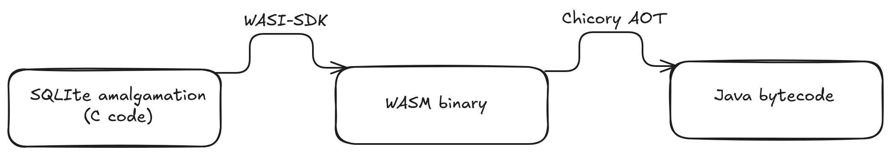
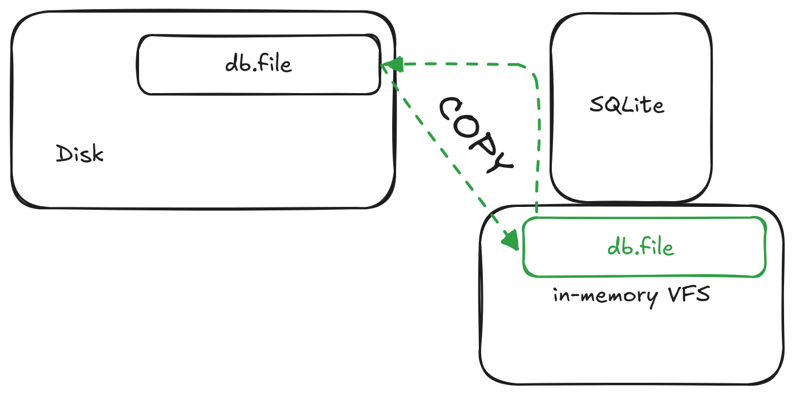

# SQLite4j

This is a port of the awesome [xerial/sqlite-jdbc](https://github.com/xerial/sqlite-jdbc/) to run in pure Java with SQLite compiled to WASM thanks to [Chicory](https://github.com/dylibso/chicory).

## Why?

This project exists because we want to run the popular and widely used [SQLite](https://www.sqlite.org/) database in pure Java.
Among the main reasons:

- **portability**: it can run on stock JVMs without additional dependencies
- **safety**: not escaping the JVM boundaries gives a number of advantages
  - the JVM will not crash because of an issue in the database
  - we get all the observability and tooling for runtime analysis

## How it works

<p align="center">
  <picture>
    
  </picture>
</p>

There are a few steps to achieve the result:

  - compile SQLite to [WebAssembly](https://webassembly.org/)
  - translate the SQLite payload to pure Java bytecode using [Chicory AOT](https://chicory.dev/docs/experimental/aot)
  - run SQLite similarly to how it's done using JNI in the original JDBC dirver, but all in pure Java
  - ship an extremely small and self contained `jar` that can run wherever the JVM can go!

## Design Decisions

You can mostly expect to have a bheavior equal to the original [xerial/sqlite-jdbc](https://github.com/xerial/sqlite-jdbc/), there are, although, some notable differences due to the different nature of WASM.

### VFS

<p align="center">
  <picture>
    
  </picture>
</p>

SQLite execution is backed by an in-memory **V**irtual **F**ile**S**ystem ([jimfs](https://github.com/google/jimfs)).
This guarantees high degrees of safety as the SQLite WASM module never access directly the host FileSystem staying fully sandboxed until an explicit operation.

There are 3 operations that will affect the host FileSystem:

- `open`: copy the database file from the host disk to the in-memory VFS
- `restore`: copy the database restore file from the host disk to the in-memory VFS
- `backup`: copy the in-memory database to the host disk

### Compilation flags

The compilation of SQLite to wasm impose some limitations:

- WASM doesn't have proper thread/concurrency handling, hence `SQLITE_THREADSAFE=0` is used to compile, meaning that only single Thread access to a database is safe.
- WAL is not enabled/supported
- the deprecated Shared Cache is fully disabled

## Usage

➡️ More usage examples and configuration are available in [USAGE.md](./USAGE.md)

SQLite JDBC is a library for accessing SQLite databases through the JDBC API. For the general usage of JDBC, see [JDBC Tutorial](https://docs.oracle.com/javase/tutorial/jdbc/index.html) or [Oracle JDBC Documentation](https://www.oracle.com/technetwork/java/javase/tech/index-jsp-136101.html).

### Install the library

With Maven add the SQLite4j library dependency:

```xml
<dependency>
    <groupId>...</groupId>
    <artifactId>???</artifactId>
    <version>latest_release</version>
</dependency>
```

### Use the library

Use the plain JDBC driver:

```java
import java.sql.Connection;
import java.sql.DriverManager;
import java.sql.ResultSet;
import java.sql.SQLException;
import java.sql.Statement;

// NOTE: Connection and Statement are AutoCloseable.
//       Don't forget to close them both in order to avoid leaks.
try
(
  // create a database connection
  Connection connection = DriverManager.getConnection("jdbc:sqlite:sample.db");
  Statement statement = connection.createStatement();
)
{
  statement.setQueryTimeout(30);  // set timeout to 30 sec.

  statement.executeUpdate("drop table if exists person");
  statement.executeUpdate("create table person (id integer, name string)");
  statement.executeUpdate("insert into person values(1, 'leo')");
  statement.executeUpdate("insert into person values(2, 'yui')");
  ResultSet rs = statement.executeQuery("select * from person");
  while(rs.next())
  {
    // read the result set
    System.out.println("name = " + rs.getString("name"));
    System.out.println("id = " + rs.getInt("id"));
  }
} catch(SQLException e) {
  e.printStackTrace(System.err);
}
```

### Project versioning explained

The project's version follows the version of the SQLite library that is bundled in the jar, with an extra digit to denote the project's increment.

For example, if the SQLite version is `3.39.2`, the project version will be `3.39.2.x`, where `x` starts at 0, and increments with every release that is not changing the SQLite version.

If the SQLite version is updated to `3.40.0`, the project version will be updated to `3.40.0.0`.

#### Hint for maven-shade-plugin

You may need to add shade plugin transformer to solve `No suitable driver found for jdbc:sqlite:` issue.

```xml
<transformer
	implementation="org.apache.maven.plugins.shade.resource.AppendingTransformer">
	<resource>META-INF/services/java.sql.Driver</resource>
</transformer>
```

```xml
<dependency>
    <groupId>org.xerial</groupId>
    <artifactId>sqlite-jdbc</artifactId>
    <version>{project-version}</version>
</dependency>
```
